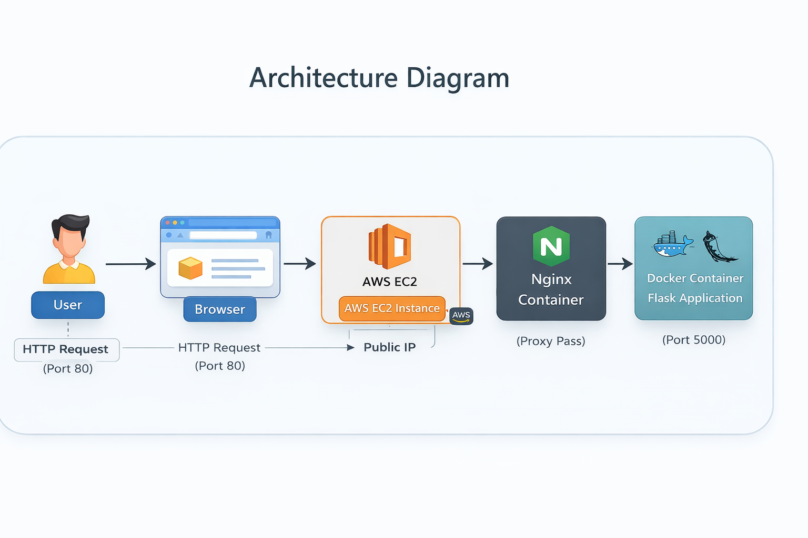
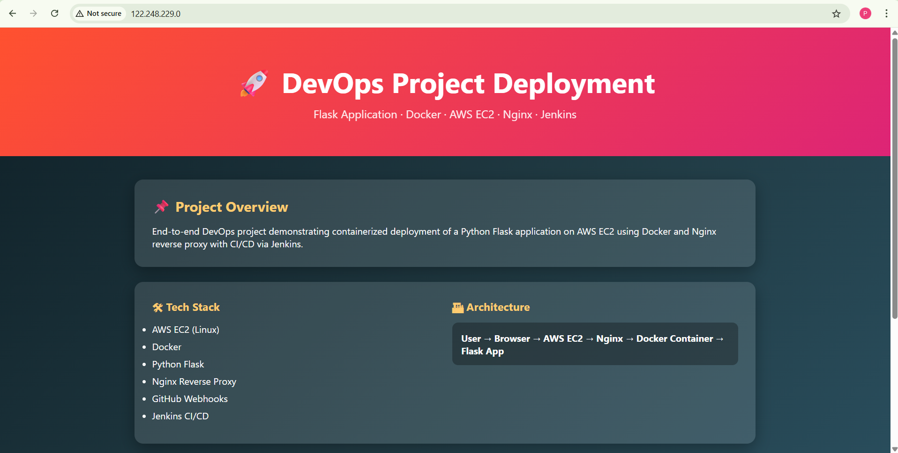
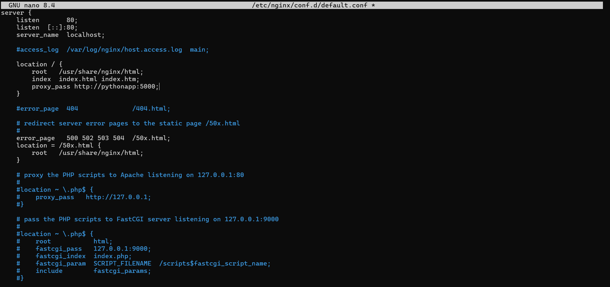
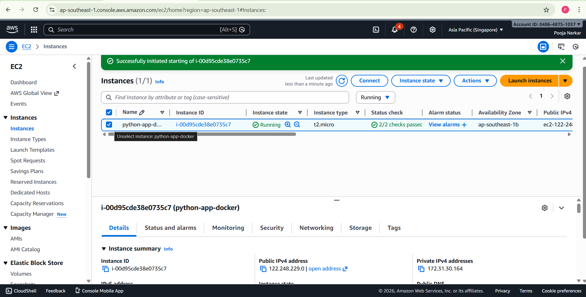

# 🚀 Python Flask Application Deployment using Docker, Nginx & AWS EC2

This project demonstrates how to deploy a **Python Flask web application** using **Docker containers** and **Nginx as a reverse proxy**, hosted on an **AWS EC2 instance**.

The Flask application runs inside one Docker container, while Nginx runs in a separate container and forwards incoming traffic to the Flask app.

---

## 🌟 Project Overview

- Python Flask application containerized using Docker
- Nginx runs as a **reverse proxy inside a Docker container**
- Application is accessed via **EC2 Public IP**
- Nginx listens on **port 80** and forwards requests to Flask on **port 5000**
- Both containers run on the same EC2 instance

---

## 🛠️ Technologies Used

- **Python (Flask)**
- **Docker**
- **Nginx (Reverse Proxy)**
- **AWS EC2 (Linux)**

---

## 🧱 Architecture Diagram

The following diagram shows the actual flow of the application:

**Browser → EC2 Public IP → Nginx Container (80) → Python Flask Container (5000)**



---

## 🔄 Application Flow

1. User accesses the application using the **EC2 Public IP**
2. Request reaches the **Nginx container** on port **80**
3. Nginx forwards the request using `proxy_pass`
4. Flask application runs inside a Docker container on port **5000**
5. Response is returned back to the browser

---

## 📸 Project Screenshots

### 🔹 Flask Application Output (Browser)


---

### 🔹 Nginx Reverse Proxy Configuration (Inside Container)
This configuration forwards traffic from port **80** to the Python container.



---

### 🔹 Running Docker Containers
Shows both **Nginx proxy container** and **Python Flask container** running.


---

### 🔹 AWS EC2 Instance Running
EC2 instance hosting Docker and containers.



---

## 📁 Project Structure

```bash
.
├── Dockerfile
├── app.py
├── requirements.txt
├── static
│   ├── style.css
│   └── script.js
├── templates
│   └── index.html
├── test
│   └── test.py
▶️ How the Containers Work

Nginx Container

Listens on port 80

Uses proxy_pass http://pythonapp:5000

Python Flask Container

Exposes port 5000

Serves the Flask application

Both containers communicate over the Docker network.

🌐 Accessing the Application

Open a browser and visit:

http://<EC2-PUBLIC-IP>

✅ Key Learnings

Containerizing a Python Flask application

Running Nginx as a Docker reverse proxy

Container-to-container communication

Deploying Dockerized apps on AWS EC2

Real-world reverse proxy setup using Nginx

👩‍💻 Author

Pooja Nerkar

If you found this project useful, feel free to ⭐ the repository.

